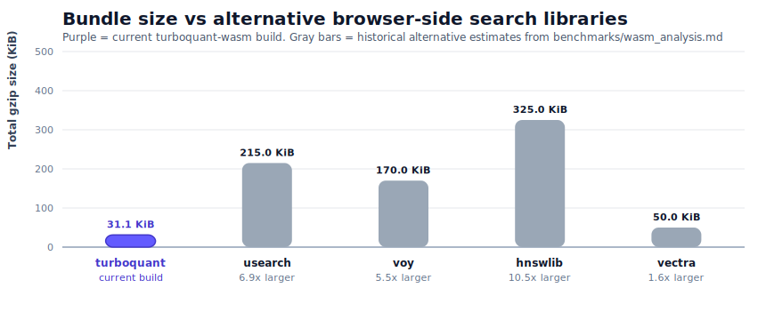
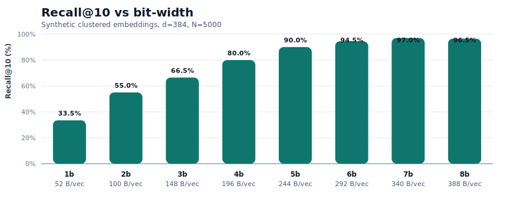
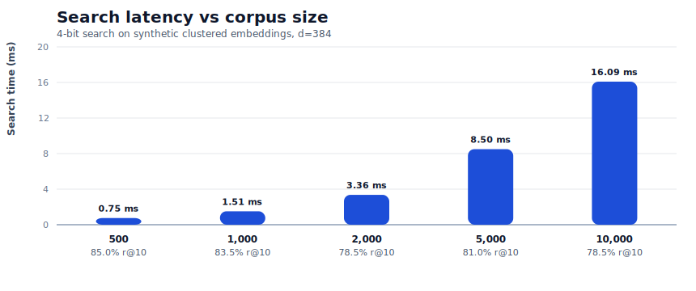
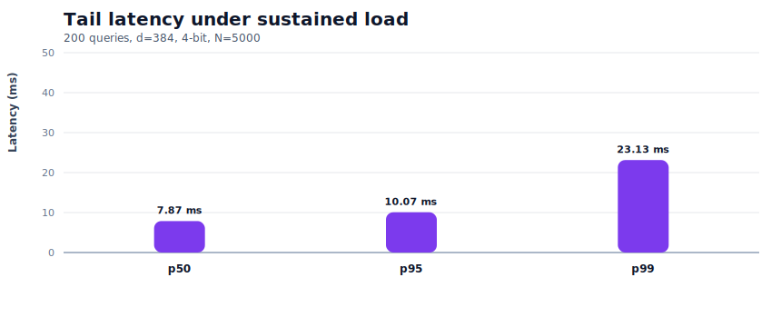
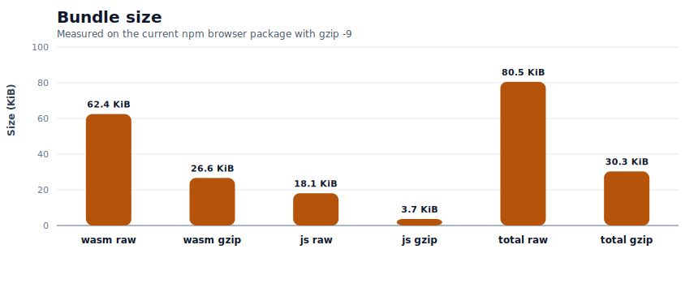
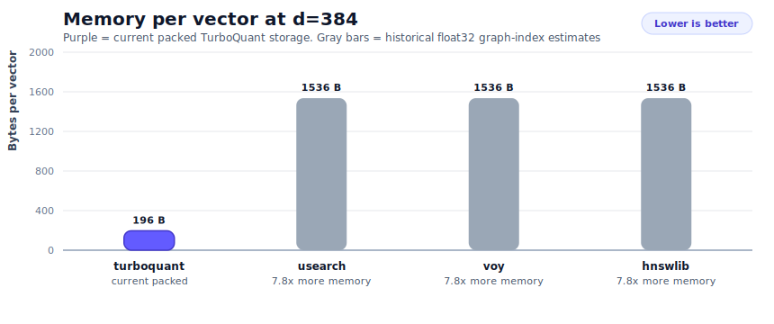
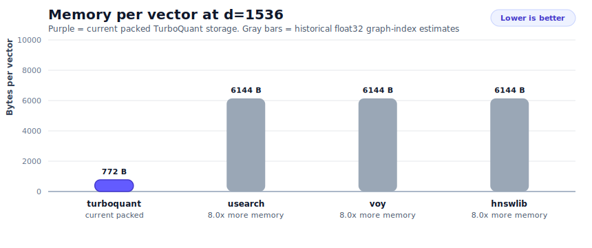

<p align="center">
  
</p>

<p align="center">
  <strong>Training-free embedding compression and local vector search for browsers, offline apps, and edge runtimes.</strong>
</p>

<p align="center">
  
</p>

<p align="center">
  Fast read: the purple bar is the current <code>turboquant-wasm</code> browser npm build at about <code>30.3 KiB</code> gzip. Gray bars are maintained comparison estimates from <code>benchmarks/wasm_analysis.md</code>, and the small labels underneath show how much larger they are relative to TurboQuant. This is positioning context, not a committed side-by-side rerun against every alternative.
</p>

`turboquant-wasm` is a Rust/WebAssembly implementation of the TurboQuant MSE variant (Algorithm 1 from the paper). It is built for applications that already have embeddings and want local retrieval without shipping a vector database or a graph index.

## Why this repo does not ship the QJL variant

The short version is that QJL works against the main design goal of `turboquant-wasm`: keep browser-side retrieval small and memory-efficient.

- QJL adds an extra projection matrix, which materially increases runtime memory pressure.
- In browser and WASM settings, that extra matrix becomes expensive quickly, especially once embedding dimensions get large.
- The MSE variant already gives strong recall for the bit-rates this repo actually targets in practice, especially at `3+` bits.
- For this project, the tradeoff was not worth it: more complexity and more memory, without fitting the core promise of a tiny browser-first package.

So the repo deliberately optimizes for the TurboQuant MSE path: smaller package, lower memory footprint, simpler runtime story.

## At a glance

- Small web package. The current measured browser npm build is about `30.3 KiB` gzip.
- Aggressive compression. With `4-bit` quantization, a `384d` vector takes about `196 B` and a `768d` vector about `388 B`.
- Direct search on compressed vectors. No full decode step on every query.
- Portable packaging. Runs in browsers, Node.js, and WASM-friendly edge runtimes.
- Persistence built in. Save indexes with `save()` and restore them with `Index.load()`.
- Example-first repo. Includes browser, WebGPU, and Cloudflare demos.

## Bundle Size Analysis

Current `turboquant-wasm` bundle numbers below come from the latest measured snapshot in `benchmarks/results/2026-04-09-m1-max-node22.json`. That snapshot keeps the `2026-04-08` search measurements and refreshes the browser npm package size to the current `pkg-bundler/` output. Alternative-library rows are maintained comparison estimates from `benchmarks/wasm_analysis.md`, not a fresh side-by-side rerun in this repo.

### Current measured package

<table align="center">
  <thead>
    <tr>
      <th>File</th>
      <th>Size</th>
    </tr>
  </thead>
  <tbody>
    <tr>
      <td><code>turboquant_wasm_bg.wasm</code></td>
      <td><code>63,943 bytes</code> (<code>62.4 KiB</code>)</td>
    </tr>
    <tr>
      <td><code>turboquant_wasm.js</code> + <code>turboquant_wasm_bg.js</code></td>
      <td><code>18,491 bytes</code> (<code>18.1 KiB</code>)</td>
    </tr>
    <tr>
      <td><strong>Total raw</strong></td>
      <td><strong><code>82,434 bytes</code> (<code>80.5 KiB</code>)</strong></td>
    </tr>
    <tr>
      <td><strong><code>.wasm</code> gzip</strong></td>
      <td><strong><code>27,279 bytes</code> (<code>26.6 KiB</code>)</strong></td>
    </tr>
    <tr>
      <td><strong><code>js</code> gzip</strong></td>
      <td><strong><code>3,758 bytes</code> (<code>3.7 KiB</code>)</strong></td>
    </tr>
    <tr>
      <td><strong>Total gzip</strong></td>
      <td><strong><code>31,037 bytes</code> (<code>30.3 KiB</code>)</strong></td>
    </tr>
  </tbody>
</table>

The npm browser entrypoint now ships the `wasm-pack --target bundler` output rather than the raw `web` loader. That keeps the published package free of a runtime `fetch()`-based Wasm bootstrap, which avoids the Socket alert on `pkg/turboquant_wasm.js` while still keeping the repo-local demos on the plain `web` target.

### Comparison with alternative browser-side vector search libraries

<table align="center">
  <thead>
    <tr>
      <th>Library</th>
      <th><code>.wasm</code> gzip</th>
      <th>JS glue gzip</th>
      <th>Total gzip</th>
      <th>Notes</th>
    </tr>
  </thead>
  <tbody>
    <tr>
      <td><strong>turboquant-wasm</strong></td>
      <td><strong><code>26.6 KiB</code></strong></td>
      <td><strong><code>3.7 KiB</code></strong></td>
      <td><strong><code>30.3 KiB</code></strong></td>
      <td>Quantization-first, no graph index</td>
    </tr>
    <tr>
      <td>usearch-wasm</td>
      <td><code>~200 KiB</code></td>
      <td><code>~15 KiB</code></td>
      <td><code>~215 KiB</code></td>
      <td>HNSW + SIMD</td>
    </tr>
    <tr>
      <td>Voy</td>
      <td><code>~150 KiB</code></td>
      <td><code>~20 KiB</code></td>
      <td><code>~170 KiB</code></td>
      <td>Rust HNSW</td>
    </tr>
    <tr>
      <td>hnswlib-wasm</td>
      <td><code>~300 KiB</code></td>
      <td><code>~25 KiB</code></td>
      <td><code>~325 KiB</code></td>
      <td>C++ via Emscripten</td>
    </tr>
    <tr>
      <td>vectra</td>
      <td><code>0 KiB</code></td>
      <td><code>~50 KiB</code></td>
      <td><code>~50 KiB</code></td>
      <td>Pure JS brute-force</td>
    </tr>
  </tbody>
</table>

`turboquant-wasm` is materially smaller than graph-based WASM alternatives. That matters most for edge deployments, mobile web, and embedded search widgets where bundle budget is tight.

### Why it stays small

- No HNSW graph or graph-tuning machinery in the binary.
- No external native dependency stack, BLAS, or LAPACK.
- A small core: PRNG, orthogonalization, centroid tables, scalar quantization, packed storage, and compressed brute-force scan.
- Size-oriented WASM build settings, plus a design that matches the algorithm instead of wrapping a larger ANN engine.

## Feature Comparison

This table keeps the product-level comparison from `benchmarks/wasm_analysis.md`, but refreshes the `turboquant-wasm` numbers to the current implementation.

<table align="center">
  <thead>
    <tr>
      <th>Feature</th>
      <th>turboquant-wasm</th>
      <th>usearch-wasm</th>
      <th>Voy</th>
      <th>hnswlib-wasm</th>
    </tr>
  </thead>
  <tbody>
    <tr><td><strong>Bundle size (gzip)</strong></td><td><code>30.3 KiB</code></td><td><code>~215 KiB</code></td><td><code>~170 KiB</code></td><td><code>~325 KiB</code></td></tr>
    <tr><td><strong>Training needed</strong></td><td>No</td><td>No, but graph build required</td><td>No, but graph build required</td><td>No, but graph build required</td></tr>
    <tr><td><strong>Quantization</strong></td><td><code>1-8</code> bit scalar, paper-backed</td><td><code>8-bit</code> scalar</td><td>None</td><td>None</td></tr>
    <tr><td><strong>Search algorithm</strong></td><td>Brute-force scan in rotated domain</td><td>HNSW graph</td><td>HNSW graph</td><td>HNSW graph</td></tr>
    <tr><td><strong>Search complexity</strong></td><td><code>O(Nd)</code></td><td><code>O(log N * d)</code></td><td><code>O(log N * d)</code></td><td><code>O(log N * d)</code></td></tr>
    <tr><td><strong>Memory per vector (<code>d=384</code>, <code>4-bit</code>)</strong></td><td><code>196 B</code></td><td><code>1,536 B</code></td><td><code>1,536 B</code></td><td><code>1,536 B</code></td></tr>
    <tr><td><strong>Memory per vector (<code>d=1536</code>, <code>4-bit</code>)</strong></td><td><code>772 B</code></td><td><code>6,144 B</code></td><td><code>6,144 B</code></td><td><code>6,144 B</code></td></tr>
    <tr><td><strong>Compression ratio</strong></td><td><code>~8x</code> at packed <code>4-bit</code></td><td><code>1x</code></td><td><code>1x</code></td><td><code>1x</code></td></tr>
    <tr><td><strong>Index build</strong></td><td><code>O(N * d^2)</code></td><td><code>O(N * log N * d)</code></td><td><code>O(N * log N * d)</code></td><td><code>O(N * log N * d)</code></td></tr>
    <tr><td><strong>Browser support</strong></td><td>All modern browsers with WASM</td><td>Browser WASM targets</td><td>Browser WASM targets</td><td>Browser WASM targets</td></tr>
    <tr><td><strong>Streaming add</strong></td><td>Yes</td><td>Yes</td><td>Yes</td><td>Yes</td></tr>
    <tr><td><strong>Theoretical guarantees</strong></td><td>MSE-optimal quantization from TurboQuant</td><td>None</td><td>None</td><td>None</td></tr>
    <tr><td><strong>Paper-backed approach</strong></td><td>Yes</td><td>No</td><td>No</td><td>No</td></tr>
  </tbody>
</table>

## Key Advantages Summary

<table align="center">
  <thead>
    <tr>
      <th>Dimension</th>
      <th>turboquant-wasm advantage</th>
    </tr>
  </thead>
  <tbody>
    <tr><td><strong>Bundle size</strong></td><td>About <code>5.6x</code> to <code>10.7x</code> smaller than graph-based WASM alternatives in the comparison tables, while still smaller than <code>vectra</code> in total shipped bytes</td></tr>
    <tr><td><strong>Memory per vector</strong></td><td>About <code>8x</code> lower than raw float32 storage at packed <code>4-bit</code>, which matters directly in browser and edge memory budgets</td></tr>
    <tr><td><strong>API simplicity</strong></td><td>Build and search without graph parameters, <code>ef</code> tuning, connectivity tuning, or external quantization passes</td></tr>
    <tr><td><strong>Theoretical foundation</strong></td><td>Based on the TurboQuant paper rather than a purely heuristic compression layer</td></tr>
    <tr><td><strong>Edge compatibility</strong></td><td>Small enough to fit comfortably in edge/serverless WASM budgets, including Cloudflare Worker-style deployments</td></tr>
    <tr><td><strong>No training</strong></td><td>Centroids are fixed and quantizer creation is deterministic from the chosen seed</td></tr>
    <tr><td><strong>Determinism</strong></td><td>Same seed and same inputs produce the same rotation and the same compressed representation</td></tr>
  </tbody>
</table>

## Good fit

- Static-site search for docs, blogs, and catalogs
- Local-first semantic search in PWAs or desktop apps
- Client-side RAG where documents never leave the machine
- Browser extensions indexing tabs or notes locally
- Edge APIs with a prebuilt compressed index

## Probably not the right tool

- Very large corpora where you want graph-based ANN over `100k+` vectors
- Workloads that need sub-millisecond latency at large `N`
- Benchmarks where you need a mature head-to-head comparison suite today

## Install

```bash
npm install @zlaabsi/turboquant-wasm
```

For npm consumers, the browser entrypoint is packaged with the `wasm-pack` bundler target. The repo-local `examples/` continue to use the raw `web` target in `pkg/`.

## Quick start

### Minimal usage

```ts
import { createQuantizer } from "@zlaabsi/turboquant-wasm";

const dim = 384;
const bits = 4;

const quantizer = await createQuantizer({ dim, bits });
const index = quantizer.buildIndex(embeddings, nVectors);
const resultIds = index.search(queryEmbedding, 10);
```

### Persist and reload

```ts
import { createQuantizer, Index } from "@zlaabsi/turboquant-wasm";

const quantizer = await createQuantizer({ dim: 384, bits: 4 });
const index = quantizer.buildIndex(embeddings, nVectors);

const bytes = index.save();
const restored = Index.load(bytes, quantizer);
const resultIds = restored.search(queryEmbedding, 10);
```

### Build from source

```bash
rustup target add wasm32-unknown-unknown
cargo install wasm-pack

git clone https://github.com/zlaabsi/turboquant-wasm.git
cd turboquant-wasm
npm run build
```

Use `npm run build:node` when you also want the Node.js target in `pkg-node/`.

## Try the examples

```bash
npm run build
python3 -m http.server 8080
```

Then open:

- `http://localhost:8080/examples/browser/`
- `http://localhost:8080/examples/transformers-js/`
- `http://localhost:8080/examples/onnx-webgpu/`

Example matrix:

<table align="center">
  <thead>
    <tr>
      <th>Example</th>
      <th>Stack</th>
      <th>Best for</th>
    </tr>
  </thead>
  <tbody>
    <tr><td><a href="examples/browser/README.md">browser</a></td><td>Plain HTML + bag-of-words</td><td>Zero-dependency smoke test</td></tr>
    <tr><td><a href="examples/transformers-js/README.md">transformers-js</a></td><td>Transformers.js + WebGPU</td><td>Fastest path to real semantic search in-browser</td></tr>
    <tr><td><a href="examples/onnx-webgpu/README.md">onnx-webgpu</a></td><td>ONNX Runtime Web + WebGPU</td><td>More control over model and tokenizer</td></tr>
    <tr><td><a href="examples/cloudflare/README.md">cloudflare</a></td><td>Cloudflare Worker</td><td>Edge search API pattern</td></tr>
  </tbody>
</table>

More detail: [examples/README.md](examples/README.md)

## Cookbook

Use these guides when you want an integration pattern instead of a toy demo:

- [Browser Search](cookbook/browser-search.md)
- [Browser Extension](cookbook/browser-extension.md)
- [Client-Side RAG](cookbook/client-rag.md)
- [Edge and Serverless](cookbook/edge-serverless.md)
- [Desktop and Mobile](cookbook/desktop-mobile.md)

## Performance snapshot

Honest version: the implementation looks useful for moderate corpus sizes, but this repo still does **not** have a full benchmark suite across devices, browsers, public datasets, and competing libraries.

The table below is the current source of truth for measured TurboQuant behavior in this repo. The old March analysis mixed theory, estimates, and older implementation assumptions; `benchmarks/wasm_analysis.md` now explains explicitly why current measured search latency is higher than those early estimates.

Current evidence is a local snapshot on:

- `Apple M1 Max`
- `Node v22.11.0`
- `npm 10.9.0`
- `Darwin 25.3.0 arm64`
- synthetic clustered embeddings

That means the numbers below are **directional evidence**, not a universal SLA.

### Current snapshot

<table align="center">
  <thead>
    <tr>
      <th>Scenario</th>
      <th>Result</th>
    </tr>
  </thead>
  <tbody>
    <tr><td><code>d=384</code>, <code>4-bit</code>, <code>N=5000</code></td><td><code>82.4%</code> recall@10, <code>11.89 ms</code> median search in the clustered-query sweep, <code>196 B/vector</code></td></tr>
    <tr><td><code>d=768</code>, <code>4-bit</code>, <code>N=3000</code></td><td><code>81.5%</code> recall@10, <code>10.37 ms</code> median search, <code>388 B/vector</code></td></tr>
    <tr><td>Sustained load at <code>N=5000</code></td><td><code>7.87 ms</code> p50, <code>10.07 ms</code> p95, <code>23.13 ms</code> p99, <code>112 q/s</code></td></tr>
    <tr><td>Web package size</td><td><code>80.5 KiB</code> raw, <code>30.3 KiB</code> gzip</td></tr>
  </tbody>
</table>

### Charts

<p align="center">
  
</p>

<p align="center">
  <em>Recall@10 versus bit-width on clustered synthetic embeddings.</em>
</p>

<p align="center">
  
</p>

<p align="center">
  <em>Search latency as corpus size grows for the 4-bit <code>d=384</code> configuration.</em>
</p>

<p align="center">
  
</p>

<p align="center">
  <em>Tail latency under sustained load for the <code>5K</code>-vector, <code>4-bit</code> search benchmark.</em>
</p>

<p align="center">
  
</p>

<p align="center">
  <em>Raw and gzip sizes for the current npm browser package built from the bundler-target output.</em>
</p>

### Raw benchmark data

- Packaging note: the `2026-04-09` snapshot refreshes bundle-size fields for the current npm browser package, while the raw search log remains the `2026-04-08` run.
- Snapshot JSON: [benchmarks/results/2026-04-09-m1-max-node22.json](benchmarks/results/2026-04-09-m1-max-node22.json)
- Raw console log: [benchmarks/results/2026-04-08-m1-max-node22-realworld.txt](benchmarks/results/2026-04-08-m1-max-node22-realworld.txt)
- Chart generator: [benchmarks/render_charts.js](benchmarks/render_charts.js)

### Comparative context

The charts above are about `turboquant-wasm` alone. The charts below add comparative context using the positioning tables in [benchmarks/wasm_analysis.md](benchmarks/wasm_analysis.md).

Important caveat: these comparative plots are **not** a fresh controlled benchmark suite run side-by-side in this repo. The TurboQuant bars use the current measured package size and current packed storage model; the alternative-library bars come from the maintained comparison estimates in `benchmarks/wasm_analysis.md`. They are here for positioning and tradeoff discussion, not to pretend we already have airtight head-to-head numbers.

Reading guide: purple is the current measured `turboquant-wasm` result, gray bars are the comparison points documented in `benchmarks/wasm_analysis.md`, and the small labels under the gray bars show the relative overhead versus TurboQuant.

<p align="center">
  
</p>

<p align="center">
  <em>Current <code>turboquant-wasm</code> package size versus maintained browser-side comparison points.</em>
</p>

<p align="center">
  
</p>

<p align="center">
  <em>Packed TurboQuant memory per vector at <code>d=384</code> versus maintained comparison points.</em>
</p>

<p align="center">
  
</p>

<p align="center">
  <em>Packed TurboQuant memory per vector at <code>d=1536</code> versus maintained comparison points.</em>
</p>

### What is still missing

- repeated runs with variance reporting
- lower-variance harnesses for build and search sweeps
- browser benchmarks on low-end and mid-range hardware
- public real-world embedding corpora
- head-to-head comparisons against exact float32 search and graph-based ANN libraries

## API and package notes

- Install from npm with `@zlaabsi/turboquant-wasm`
- Repository: `github.com/zlaabsi/turboquant-wasm`
- Primary workflow: create quantizer -> build or stream index -> save/load -> search
- Generated artifacts live in `pkg/` and `pkg-node/`

## Development

For local workflow, release process, and commit conventions, see [CONTRIBUTING.md](CONTRIBUTING.md).

Common commands:

```bash
npm run build
npm run build:node
npm run test
npm run verify
npm run bench:realworld
npm run bench:charts
```

## References

- [TurboQuant: Online Vector Quantization with Near-optimal Distortion Rate](https://arxiv.org/abs/2504.19874)
- [PolarQuant](https://arxiv.org/abs/2502.02617)
- [QJL](https://arxiv.org/abs/2406.03482)

## License

Apache-2.0
